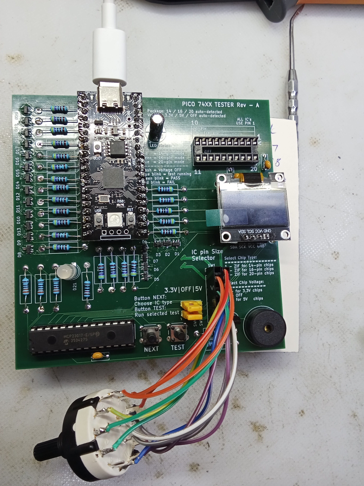

# Pico 74xx IC Tester

*Rev A prototype during hardware validation and firmware bring-up.*
---


A Raspberry Pi Pico based tester for 74xx-series logic ICs.

Designed as a practical bench instrument for testing 74LS, 74HC, 74HCT and compatible logic devices used in retro-computing, repair, and electronics projects. The tester supports 14-pin, 16-pin and 20-pin DIP devices, automatic package detection, OLED status display, and a growing library of validated IC tests.

## Features

- Tests common 14-pin, 16-pin, and 20-pin 74xx logic ICs
- Raspberry Pi Pico / RP2040 based
- 20-pin ZIF socket
- 3.3V / OFF / 5V DUT voltage selector
- 14 / 16 / 20-pin package selector
- GPIO protection using series resistors and clamp diodes
- MCP23017 I/O expander for buttons, switch sensing, RGB LED, and buzzer
- USB terminal output
- SSD1306 128×64 OLED display

## Current Status

Rev A hardware has been assembled and validated.

### Verified Hardware

- RP2040 Pico controller
- MCP23017 I/O expander
- 20-pin ZIF socket interface
- 14-pin, 16-pin and 20-pin package support
- 3.3V / OFF / 5V DUT voltage selection
- SSD1306 128×64 OLED display
- Rotary encoder interface
- TEST and NEXT pushbuttons
- RGB status LED
- Buzzer
- Shared I²C bus (MCP23017 + OLED)

### Supported Device Categories

Current firmware includes support for
- logic gates
- decoders
- counters
- registers
- latches
- buffers
- shift registers
- Individual device validation is ongoing.

## Project Status

**Status:** Active Development

### Current Release

**Firmware:** Rev-B.1 Stable

### Hardware Status

* Rev A: Hardware validated
* Rev B: Hardware assembled and operational
* Firmware: Stable core framework complete
* IC library: Continuing expansion and validation

Future advanced development is planned under the **Logic IC Diagnostic Analyzer** project.

## Rev B Firmware Status

### Completed

* Power-on self test (POST)
* SSD1306 OLED user interface
* MCP23017 I/O expander support
* Rotary encoder navigation
* Package auto-detection (14/16/20 pin)
* DUT voltage detection (3.3V / 5V)
* Quick test mode
* Full test mode
* Soak 50 mode
* Soak 500 mode
* Soak Infinite mode
* OLED error and status screens
* Wrong package detection
* Terminal diagnostic output

### Verified IC Tests

* 7400 NAND
* 7403 Open Collector NAND
* 7414 Schmitt Trigger Inverter
* 74139 Dual Decoder
* 74163 Synchronous Counter

### In Progress

* Additional IC validation
* Expanded device library
* Documentation updates
* 3D printed enclosure development


## Documentation

- [Build Guide](docs/build-guide.md)
- [Usage Guide](docs/usage-guide.md)
- [Supported ICs](docs/supported-ics.md)
- [Bring-up Checklist](docs/bringup-checklist.md)
- [Troubleshooting](docs/troubleshooting.md)
- [Rev B Roadmap](docs/rev-b-roadmap.md)

## Hardware

See:

```text
hardware/revA/
hardware/revB/
```

Hardware: CERN-OHL-S v2

Firmware/docs: MIT

---
