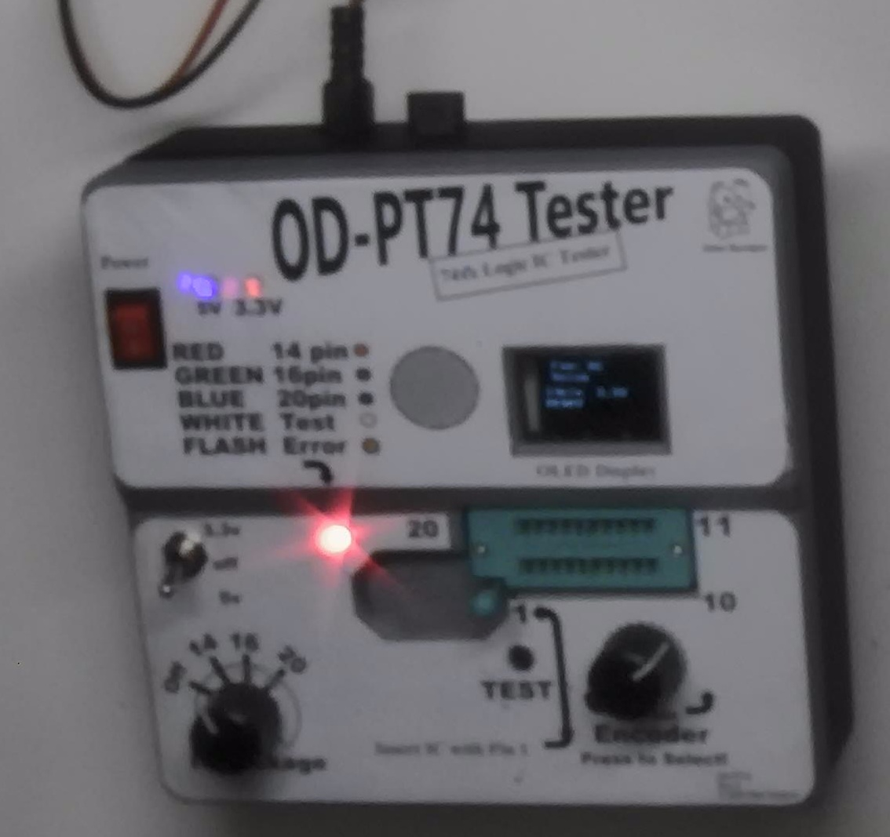
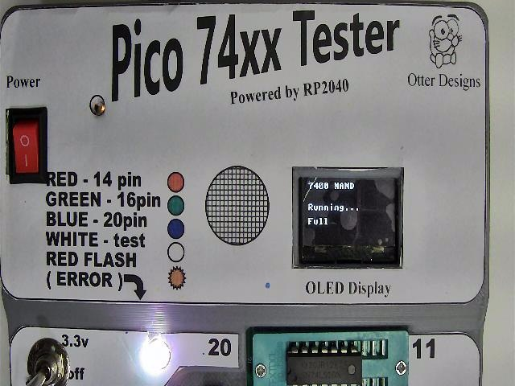
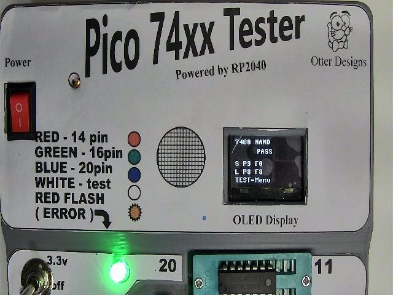
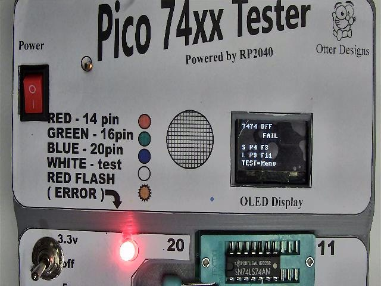

# OD-PT74

Pico 74xx Logic IC Tester

OD-PT74 is the first bench instrument in the Otter Designs Test Equipment family.


An open-source bench instrument for testing classic 74xx-series logic ICs.



*OD-PT74 Pico 74xx IC Tester installed in the production enclosure.*


---

## Overview

The OD-PT74 Pico 74xx IC Tester is a Raspberry Pi Pico (RP2040) based instrument designed to test common 74xx logic ICs used in retro-computing, electronics repair, education, and hobby projects.

The Rev-C platform combines dedicated hardware, a graphical OLED user interface, and modular MicroPython firmware to provide fast, repeatable testing of common logic devices in a compact desktop instrument.

Current support focuses on standard 14-pin, 16-pin, and 20-pin DIP devices from the 74LS, 74HC, 74HCT and selected compatible logic families.

## 🚀 Quick Start

1. Download or clone this repository.
2. Install **Thonny** from https://thonny.org
3. Install **MicroPython** onto your Raspberry Pi Pico.
4. Copy the following files to the Pico:
   - `main.py`
   - `ssd1306.py`
5. Power up the tester.
6. Verify the POST completes successfully.
7. Start testing ICs!

For detailed installation instructions, see the **Documentation Index** or jump directly to one of the guides below.

---

## Documentation

| Section | Description |
|---------|-------------|
| [📖 Documentation Index](docs/README.md) | Browse all project documentation |
| [🚀 Getting Started](docs/guides/getting-started.md) | First-time setup |
| [🔧 Build Guide](docs/guides/build-guide.md) | Hardware assembly |
| [🔧 Front Panel Wiring Guide](docs/guides/Switch-Wiring-guide.md)
| [💾 Firmware Guide](docs/guides/firmware-guide.md) | Install and update the firmware |
| [▶️ Usage Guide](docs/guides/usage-guide.md) | Operating the tester |
| [🧩 Supported ICs](docs/guides/supported-ics.md) | Supported logic device library |
| [🛠 Troubleshooting Guide](docs/guides/troubleshooting-guide.md) | Diagnose common issues |

---

## Key Features

* Raspberry Pi Pico (RP2040) based design
* Supports standard 14-, 16- and 20-pin DIP packages
* Compatible with common 74LS, 74HC and 74HCT logic families
* Automatic package detection
* Quick, Full and Soak test modes
* Power-On Self Test (POST)
* 128×64 OLED graphical interface
* Rotary encoder driven menu system
* USB serial diagnostics
* Open-source hardware and firmware

---

## Gallery



*Figure 1. Full functional test in progress.*

* 


*Figure 2. OLED displaying a successful PASS result.*



*Figure 3. OLED displaying a FAIL result.*


*Figure 4. USB serial diagnostic output in Thonny.*


## Hardware Summary

| Feature      | Specification                            |
| ------------ | ---------------------------------------- |
| MCU          | Raspberry Pi Pico (RP2040)               |
| Display      | 128 × 64 SSD1306 OLED                    |
| DUT Packages | 14, 16 and 20-pin DIP                    |
| DUT Supply   | 3.3 V / OFF / 5 V                        |
| Interface    | Rotary encoder + push buttons            |
| Firmware     | MicroPython                              |
| License      | MIT (firmware), CERN-OHL-S v2 (hardware) |

---

## Current Release

Hardware PCB Revision: Rev-C
Firmware Version: v1.0.0

This is the first public release of the OD-PT74.

Earlier PCB revisions (Rev-A and Rev-B) were internal development prototypes and were never publicly released.

The project is now focused on:

* expanding the verified IC library
* firmware maintenance and refinement
* documentation improvements
* community contributions

Advanced diagnostic capabilities are planned for the separate Logic IC Diagnostic Analyzer project.

---

## Hardware

Designed for through-hole construction using readily available components with a few SMDs.

Rev-C introduces a production-quality hardware platform featuring:

* Raspberry Pi Pico controller
* 20-pin ZIF socket
* 3.3 V / OFF / 5 V DUT power selection
* Package selection for 14-, 16- and 20-pin devices
* MCP23017 I/O expansion
* SSD1306 OLED display
* Rotary encoder navigation
* TEST and NEXT push buttons
* RGB status LED
* Audible buzzer
* Shared I²C bus architecture
* 5 V power indicator LED
* 3.3 V power indicator LED

GPIO protection is provided through series resistors and clamp diodes to improve robustness during normal operation.

---

## Firmware

The firmware uses a modular architecture that separates hardware drivers, IC definitions, and user interface logic for ease of maintenance and future expansion.

Implemented functionality includes:

* Power-On Self Test (POST)
* OLED diagnostics
* I²C bus diagnostics
* MCP23017 detection
* Package detection
* DUT voltage detection
* Menu-driven user interface
* Serial diagnostic output
* Quick Test mode
* Full Functional Test mode
* Soak testing (50, 500 and Continuous)

---

## Test Modes

| Mode       | Description                                  |
| ---------- | -------------------------------------------- |
| Quick      | Fast functional verification                 |
| Full       | Complete functional testing                  |
| Soak 50    | 50 consecutive test cycles                   |
| Soak 500   | 500 consecutive test cycles                  |
| Continuous | Unlimited endurance testing                  |
| POST       | Automatic hardware self-test during power-up |

During startup the tester automatically verifies:

* OLED communication
* MCP23017 communication
* I²C bus operation
* Package selection
* DUT voltage selection
* TEST button operation

Diagnostic information is displayed on both the OLED and the USB serial console.

---

## Getting Started

1. Assemble the hardware.
2. Install MicroPython on the Raspberry Pi Pico.
3. Copy the firmware to the Pico.
4. Power on the tester.
5. Allow the Power-On Self Test to complete.
6. Select the package size.
7. Insert the IC into the ZIF socket.
8. Press **TEST**.

---

## Project Evolution

| Revision | Description                                    |
| -------- | ---------------------------------------------- |
| Rev-C    | First public production release of the OD-PT74 |

Earlier prototype revisions were used during development and are documented in the project history.

---

## Repository Layout

```text
hardware/
firmware/
graphics/
images/
templates/

docs/
├── README.md
├── guides/
├── reference/
├── development/
├── archive/
└── images/

README.md
CHANGELOG.md
CONTRIBUTING.md
LICENSE
```

---


## Contributing

Contributions are welcome, particularly:

* verified IC definitions
* bug reports
* documentation improvements
* hardware testing
* firmware enhancements

When submitting a new IC definition, please include:

* source code
* pin mapping
* tested device family
* hardware validation results
* Quick, Full and Soak test results where applicable

---

## License

Hardware is licensed under the **CERN-OHL-S v2**.

Firmware and documentation are licensed under the **MIT License**.

See the LICENSE file for details.

---

## Acknowledgements

Developed by **Otter Designs**, New Zealand.

If you build an OD-PT74, we'd love to see it! Share your photos, improvements, verified IC definitions, or project ideas by opening an issue or discussion on GitHub.

---

## Project Reference

| Document | Description |
|----------|-------------|
| [📐 Project Overview](docs/reference/project-overview.md) | Project goals and architecture |
| [📘 Hardware Design Guide](docs/reference/hardware-design-guide.md) | Hardware architecture and design |
| [📝 Documentation Style Guide](docs/reference/documentation-style-guide.md) | Documentation standards |

## Development

| Document | Description |
|----------|-------------|
| [📅 Milestones](docs/development/Milestones.md) | Project progress and milestones |

## Project Preservation

Where practical, the OD-PT74 repository includes the original source files used to create the project.

Examples include:

- KiCad PCB source
- FreeCAD enclosure source
- SVG diagrams
- Firmware source code
- Documentation source

This approach helps ensure the project remains buildable, maintainable and adaptable for many years to come.

| [✅ Bring-up Checklist](docs/development/bringup-checklist.md) | Hardware verification checklist |