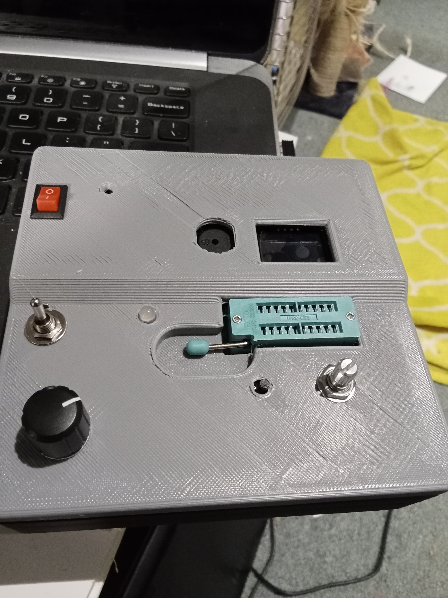

# Pico 74xx IC Tester

An open-source bench instrument for testing classic 74xx-series logic ICs.



*Rev-B hardware installed in the production enclosure.*


---

## Overview

The Pico 74xx IC Tester is a Raspberry Pi Pico (RP2040) based instrument designed to test common 74xx logic ICs used in retro-computing, electronics repair, education, and hobby projects.

The Rev-B platform combines dedicated hardware, a graphical OLED user interface, and modular MicroPython firmware to provide fast, repeatable testing of common logic devices in a compact desktop instrument.

Current support focuses on standard 14-pin, 16-pin, and 20-pin DIP devices from the 74LS, 74HC, 74HCT and selected compatible logic families.

---

## Key Features

* Raspberry Pi Pico (RP2040) based design
* Supports standard 14-, 16- and 20-pin DIP packages
* Compatible with common 74LS, 74HC and 74HCT logic families
* Automatic package detection
* Quick, Full and Soak test modes
* Power-On Self Test (POST)
* 128×64 OLED graphical interface
* Rotary encoder driven menu system
* USB serial diagnostics
* Open-source hardware and firmware

---

## Hardware Summary

| Feature      | Specification                            |
| ------------ | ---------------------------------------- |
| MCU          | Raspberry Pi Pico (RP2040)               |
| Display      | 128 × 64 SSD1306 OLED                    |
| DUT Packages | 14, 16 and 20-pin DIP                    |
| DUT Supply   | 3.3 V / OFF / 5 V                        |
| Interface    | Rotary encoder + push buttons            |
| Firmware     | MicroPython                              |
| License      | MIT (firmware), CERN-OHL-S v2 (hardware) |

---

## Current Release

**Release:** Rev-B v1.0.0

Rev-B is the current production hardware and is considered feature complete.

The project is now focused on:

* expanding the verified IC library
* firmware maintenance and refinement
* documentation improvements
* community contributions

Advanced diagnostic capabilities are planned for the separate Rev-C Logic IC Diagnostic Analyzer project.

---

## Hardware

Rev-B introduces a production-quality hardware platform featuring:

* Raspberry Pi Pico controller
* 20-pin ZIF socket
* 3.3 V / OFF / 5 V DUT power selection
* Package selection for 14-, 16- and 20-pin devices
* MCP23017 I/O expansion
* SSD1306 OLED display
* Rotary encoder navigation
* TEST and NEXT push buttons
* RGB status LED
* Audible buzzer
* Shared I²C bus architecture

GPIO protection is provided through series resistors and clamp diodes to improve robustness during normal operation.

---

## Firmware

The firmware uses a modular architecture that separates hardware drivers, IC definitions, and user interface logic for ease of maintenance and future expansion.

Implemented functionality includes:

* Power-On Self Test (POST)
* OLED diagnostics
* I²C bus diagnostics
* MCP23017 detection
* Package detection
* DUT voltage detection
* Menu-driven user interface
* Serial diagnostic output
* Quick Test mode
* Full Functional Test mode
* Soak testing (50, 500 and Continuous)

---

## Test Modes

| Mode       | Description                                  |
| ---------- | -------------------------------------------- |
| Quick      | Fast functional verification                 |
| Full       | Complete functional testing                  |
| Soak 50    | 50 consecutive test cycles                   |
| Soak 500   | 500 consecutive test cycles                  |
| Continuous | Unlimited endurance testing                  |
| POST       | Automatic hardware self-test during power-up |

During startup the tester automatically verifies:

* OLED communication
* MCP23017 communication
* I²C bus operation
* Package selection
* DUT voltage selection
* TEST button operation

Diagnostic information is displayed on both the OLED and the USB serial console.

---

## Getting Started

1. Assemble the Rev-B hardware.
2. Install MicroPython on the Raspberry Pi Pico.
3. Copy the firmware to the Pico.
4. Power on the tester.
5. Allow the Power-On Self Test to complete.
6. Select the package size.
7. Insert the IC into the ZIF socket.
8. Press **TEST**.

---

## Documentation

Additional documentation is available in the `docs/` directory, including:

* Build Guide
* Usage Guide
* Supported ICs
* Bring-up Checklist
* Troubleshooting Guide
* Rev-B Roadmap

---

## Project Evolution

| Revision | Purpose                                                                              |
| -------- | ------------------------------------------------------------------------------------ |
| Rev-A    | Proof-of-concept platform used to validate the electronics and firmware architecture |
| Rev-B    | Production bench instrument intended for everyday use                                |
| Rev-C    | Future advanced logic IC diagnostic platform                                         |

---

## Repository Layout

```text
hardware/
├── RevA/
└── RevB/

firmware/

docs/

images/
```

---

## Contributing

Contributions are welcome, particularly:

* verified IC definitions
* bug reports
* documentation improvements
* hardware testing
* firmware enhancements

When submitting a new IC definition, please include:

* source code
* pin mapping
* tested device family
* hardware validation results
* Quick, Full and Soak test results where applicable

---

## License

Hardware is licensed under the **CERN-OHL-S v2**.

Firmware and documentation are licensed under the **MIT License**.

See the LICENSE file for details.

---

## Acknowledgements

Developed by **Otter Designs**, New Zealand.

Special thanks to everyone who tests hardware, validates IC definitions, reports issues, and contributes improvements to the project.

---

If you build a Pico 74xx IC Tester, we'd love to see it. Feel free to share photos, improvements, and verified IC definitions through GitHub.
