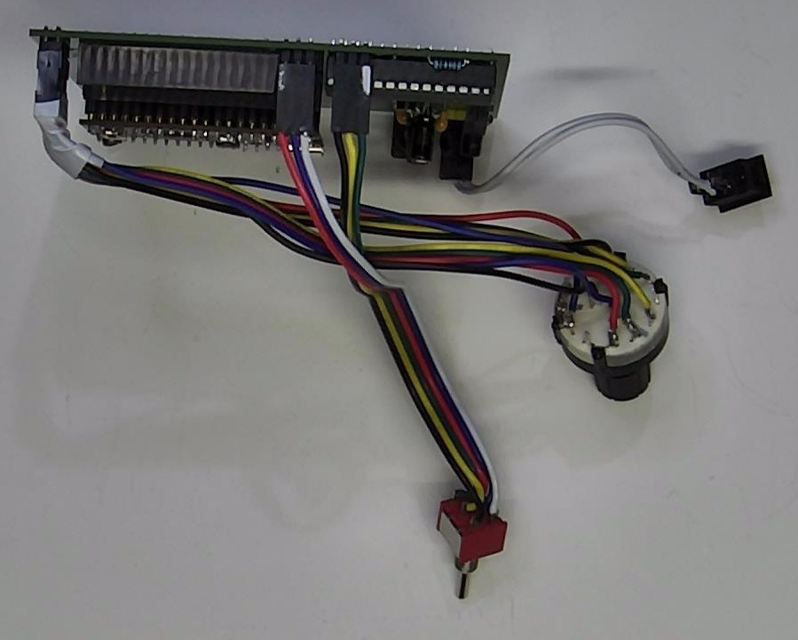
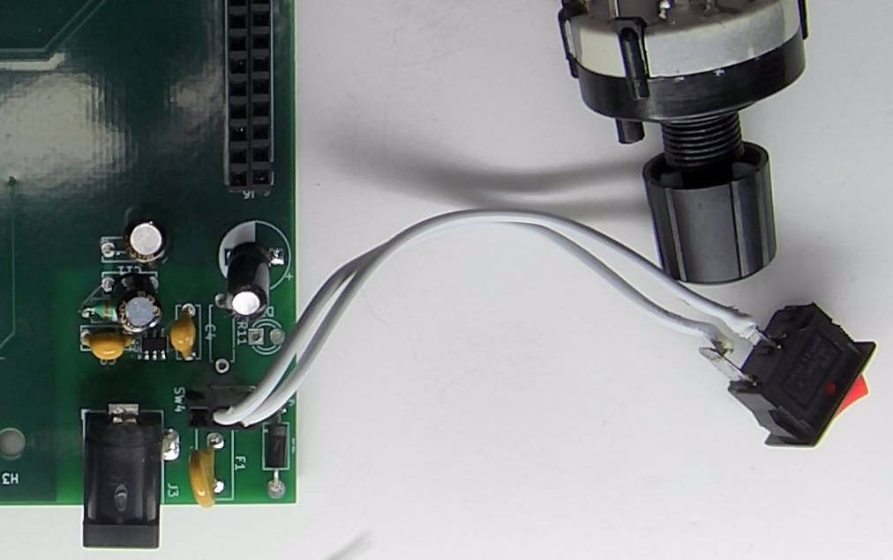
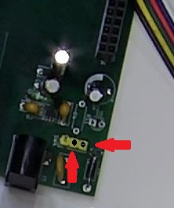
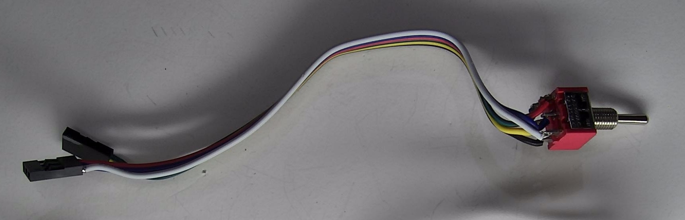
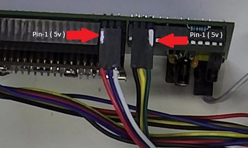
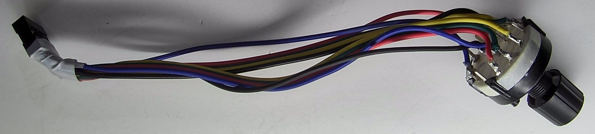
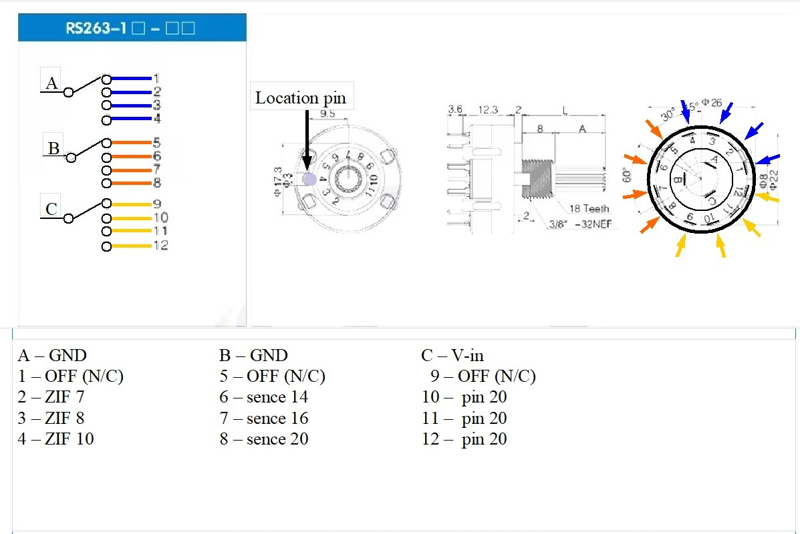
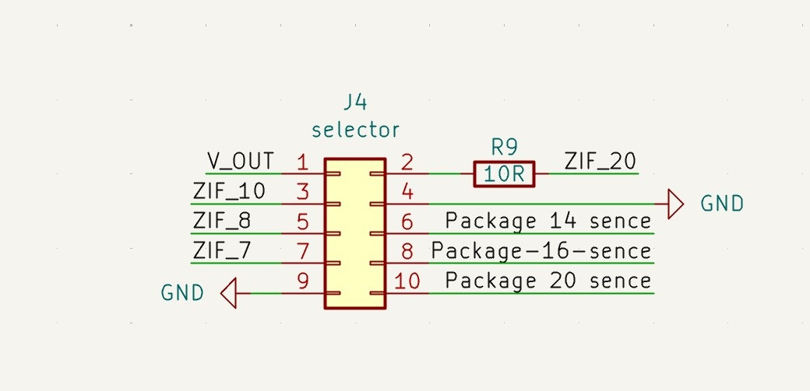
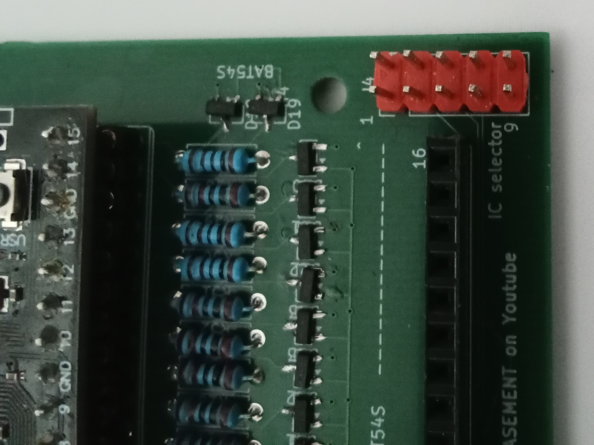

# Front Panel Switch Wiring Guide

*Figure 1 - The Installed Switches On Base board.*

The OD-PT74 uses three off-board switches mounted in the front panel.

These switches are connected to the PCB using pre-made wiring harnesses. This guide explains the function of each switch and how each connector should be wired.

---

## Power Switch

*Figure 2 - The Main 5v DC Power Switch.*

This switch connects and disconnects the external DC input to the tester.

### Wiring the Power ON/OFF Switch

The power switch is a standard SPST ON/OFF switch and is not polarised, so either wire may be connected to either terminal.

Check the switch orientation before installing it into the top case.

The 2 wires go on the 2 outside pins of the 3 pin plug.

*Figure 3 - The Main 5v DC Power Switch headder.*

---

## IC Power / Sense

Selects the operating voltage for the IC under test and the voltage rail monitored by the tester.

*Figure 4 - The IC Power and Sense Switch.*

This switch handles 2 important jobs in the tester and it is a DPDT switch.

The switch has 3 positions because when changing IC voltage you need to remove the power before you select the next voltage or you very well could spike the IC, MCU or RP2040.

The switch is divided in to 2 separate functions.

1. first side of the switch - IC Voltage Select:

Wiring Diagram

Left Terminal Pin1  → 5 V

Centre Terminal pin2  → Common

Right Terminal pin3  → 3.3 V

Operation

Switch Position	Result

Up	5 V
Centre	OFF
Down	3.3 V

2. second side of the switch pin-1 to 5v sense / pin-2 to ground / pin-3 to 3.3v sense. 

Wiring Diagram

Left Terminal Pin1  → 5 V sense to MCP

Centre Terminal pin2  → Selected Voltage

Right Terminal pin3  → 3.3 V to MCP

Operation

Switch Position	Result

Up	5 V sense
Centre	OFF
Down	3.3 V sense

*Figure 5 - selector switch-header sockets.*

>Tip: Use different coloured wires where possible. This makes identifying each connector much easier during assembly and troubleshooting.

---

## IC Package Select Switch

*Figure 6 - IC Package Select Switch.*

This switch is a very important one as it selects the type of IC package you are going to test.

The Package selector switch is a 3 Pole by 4 position rotary switch and is divided into 3 jobs.

*Centre Pin-A = Ground Pin for ZIF:*

Centre Pin-A  →  Pin 1 OFF
	      →  Pin 2 - pin 7 on ZIF.
	      →  Pin 3 - pin 8 on ZIF.
              →  Pin 4 - pin 10 on ZIF.

*Centre Pin-B = Ground for Package sence:*

Centre Pin-B  →  Pin 1 OFF
	      →  Pin 2 Package sence 14.
	      →  Pin 3 Package sence 16.
              →  Pin 4 Package sence 20.

*Centre Pin-C = Voltage in for ZIF*

Centre Pin-C  →  Pin 1 OFF
	      →  Pin 2 Voltage pin 20 ZIF.
	      →  Pin 3 Voltage pin 20 ZIF.
              →  Pin 4 Voltage pin 20 ZIF.

*Figure 7 - IC Package Select Switch.*

*Header Plug Pin out*
 
	     Pin 1 →  Pin C Voltage in
	     Pin 2 →  Pin 12/11/10 Voltage to pin 20 ZIF.
	     Pin 3 →  Pin 4 Ground pin 10 ZIF.
             Pin 4 →  Pin B Ground sence pin.
	     Pin 5 →  Pin 3 Ground pin 8 ZIF.
	     Pin 6 →  Pin 6 sence 14 return.
	     Pin 7 →  Pin 2 Ground pin 7 ZIF.
	     Pin 8 →  Pin 7 sence 16 return.
             Pin 9 →  Pin A Ground in for ZIF.
	     Pin 10 →  Pin 8 sence 20 return.

*Figure 8 - Package Select Board Header KiCad.*

*Figure 9 - Package Select Board Header.*

---
## Related Documentation

| Document | Description |
|----------|-------------|
| [🏠 Project Home](../../README.md) | Return to the main project page |
| [📖 Documentation Index](../README.md) | Documentation overview |

| ← Previous | Next → |
|------------|--------|
| [🔧 Build Guide](build-guide.md) | [💾 Firmware Guide](firmware-guide.md) |