# Build Guide

## Introduction

This guide describes the assembly of the **OD-PT74 Pico 74xx IC Tester** hardware.

The Rev-C design consists of two printed circuit boards that together form the complete tester. 

This guide follows the recommended assembly sequence, including inspection and verification checkpoints, to help ensure a successful build.

---

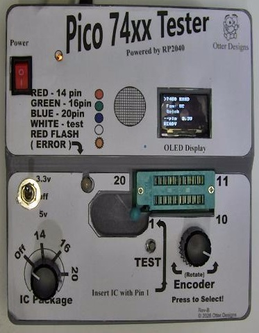

*Figure 1. Completed OD-PT74 Pico 74xx IC Tester.*

---

## Before you begin

### Tools required

* Fine-tip soldering iron
* Quality electronic solder
* Side cutters
* Small pliers
* Tweezers
* Digital multimeter
* Magnification (recommended)

### Parts required

For a complete component list, refer to the Main Board BOM and Top Board BOM.

Before beginning assembly:

* Verify all components are present.
* Check resistor values.
* Identify all polarised components.
* Familiarise yourself with the PCB layout.

For a complete list check the **main-board & top-board b.o.m**

> [!TIP]
>
> Sort resistors and capacitors by value before starting. This makes assembly faster and significantly reduces mistakes.

---

## Assembly

## Stage 1 – Power supply

The Rev-C tester includes an onboard power supply. Assemble and verify this section before installing any other components.

Install:

* BAT54S protection diode(s)
* 3.3 V voltage regulator
* Associated bypass capacitors

Figure 2 shows the completed power supply section before electrical verification.

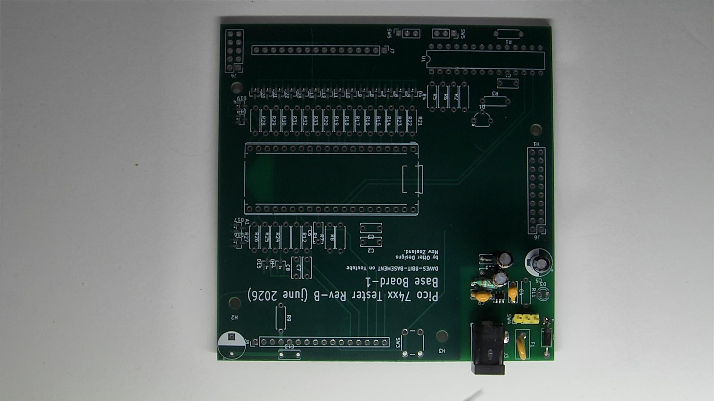

*Figure 2. Main board power supply assembled.*

### Power supply verification

Connect a regulated 5 V DC supply.

Verify:

* 5 V input present
* Stable 3.3 V regulator output
* No excessive current draw
* No component heating

---

**Testing for 3.3 v**

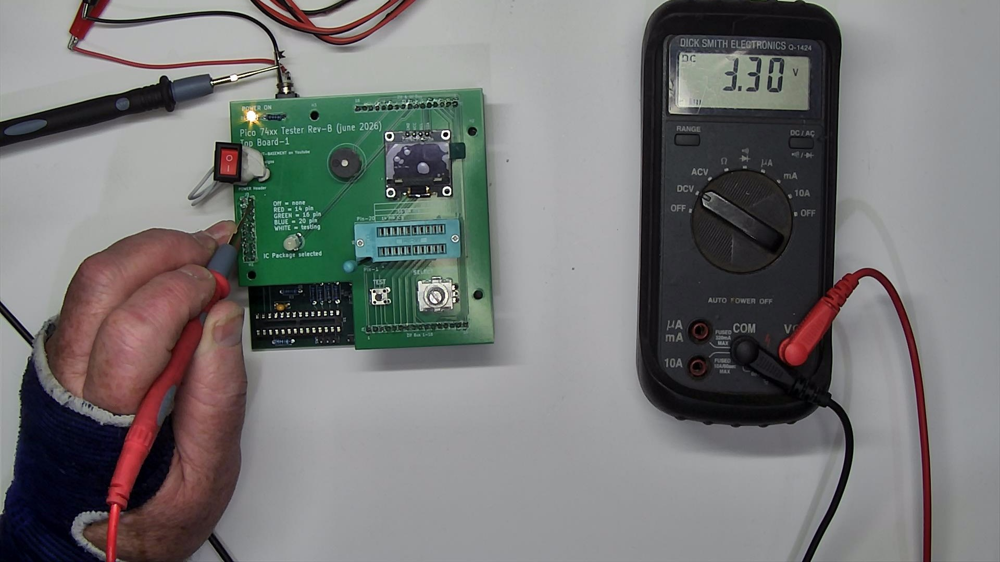

*Figure 3. Test 3.3 v on power board.*

---

**Testing for 5 v**

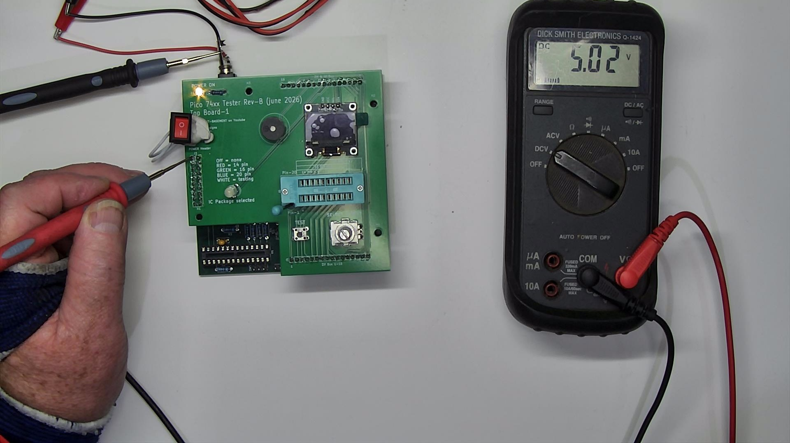

*Figure 4. Test 5 v on power board.*

---

** Disconnect power before continuing. **

> [!IMPORTANT]
>
> Verifying the power supply first makes fault finding much easier than troubleshooting a fully populated board.

---

## Stage 2 – Main board assembly

Populate the main board using the following order:

1. Resistors
2. Ceramic capacitors
3. Diodes
4. IC sockets
5. Headers and connectors

Figure 5 shows the main board after the passive components have been installed.

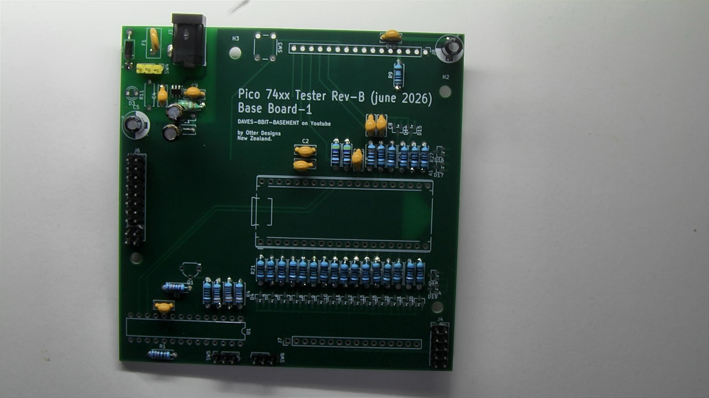

*Figure 5. main board after passive components.*

Continue with:

* Push buttons
* LEDs
* Buzzer
* Remaining connectors

Complete the remaining through-hole components as shown in Figure 6.

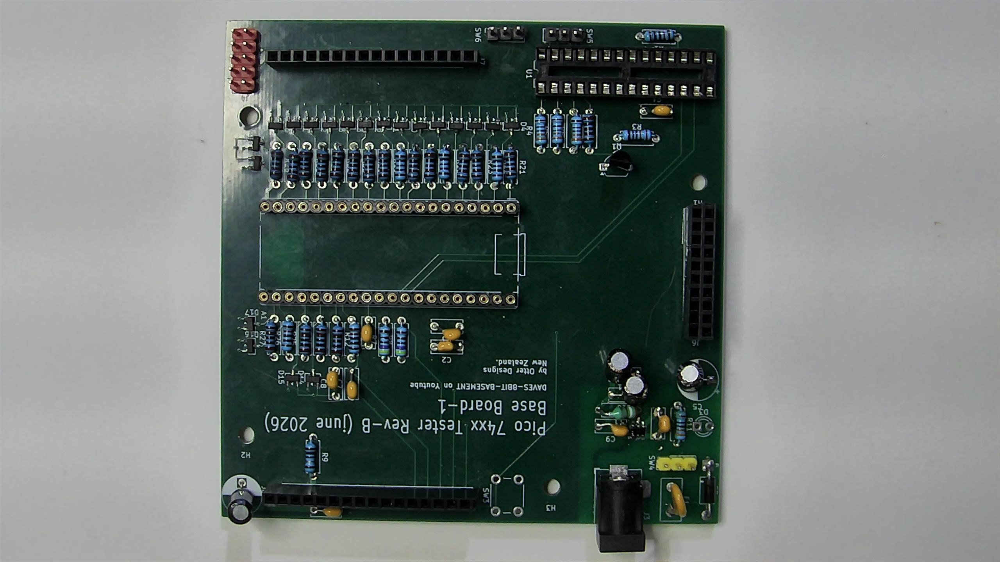

*Figure 6. Completed main board assembly.*

### Assembly Checkpoint

Before continuing:

* ✓ No solder bridges
* ✓ Correct resistor values
* ✓ Correct diode orientation
* ✓ All IC sockets aligned
* ✓ Board cleaned and inspected

---

## Stage 3 – Top board assembly

> [!IMPORTANT]
> Before installing the OLED display, apply power and verify:
>
> - The 5 V rail measures correctly.
> - The 3.3 V rail measures correctly.
> - The 5 V and 3.3 V power indicators illuminate (if fitted).
>
> Disconnect power before installing the OLED display and continuing with Stage 3.

Assemble the top board.

Pay particular attention to:

* OLED header orientation
* Rotary encoder alignment
* Board-to-board connector alignment

Figure 7 shows the top board after the initial components have been installed.

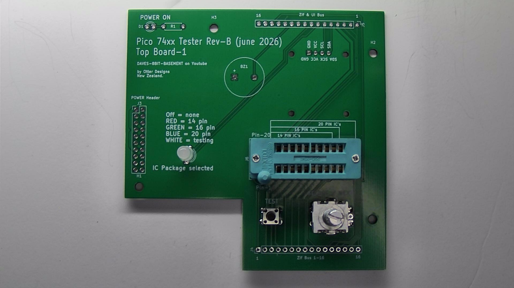

*Figure 7. top board during assembly.*

Figure 8 shows the completed top board ready for final inspection.

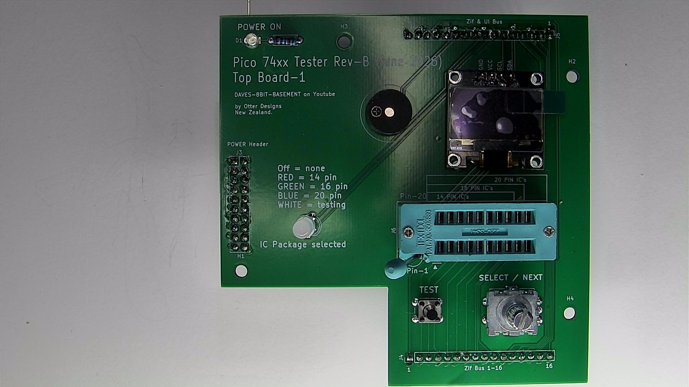

*Figure 8. completed top board assembly.*

> [!NOTE]
> **Assembly Checkpoint**
>
> Before continuing, confirm:
>
> - No solder bridges
> - Correct resistor values
> - Correct diode orientation
> - All IC sockets aligned
> - Board cleaned and inspected

---

## Stage 4 – Raspberry Pi Pico

Install the Raspberry Pi Pico only after both boards have passed inspection.

Before fitting the Pico:

* Verify there are no shorts between power rails.
* Check connector alignment.
* Confirm correct orientation.

Figure 9 shows the correct installation of the Raspberry Pi Pico.

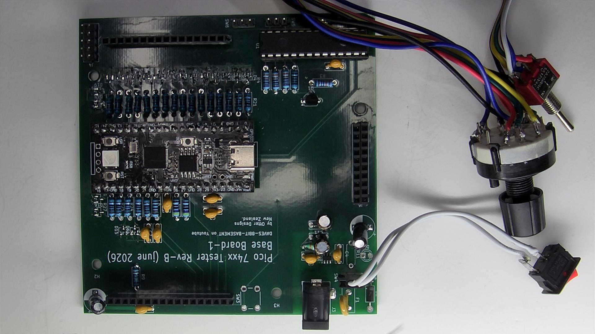

*Figure 9. Raspberry Pi Pico installed.*

---

## Stage 5 – Final assembly

Join the main and top boards.

Install:

* OLED module
* Remaining hardware
* Spacers and fasteners (if fitted)

Carry out a final visual inspection.

Figure 10 shows the completed hardware assembly before electrical testing.

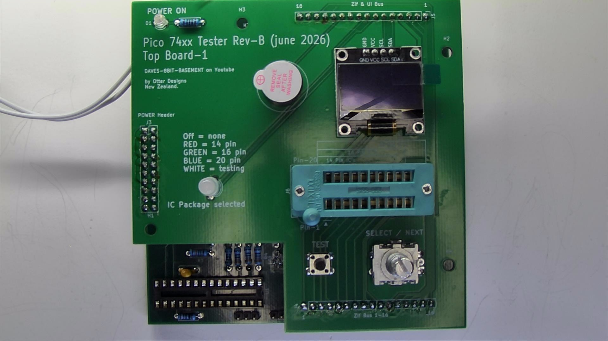

*Figure 10. Completed top board assembly.*

---

## Front Panel Wiring

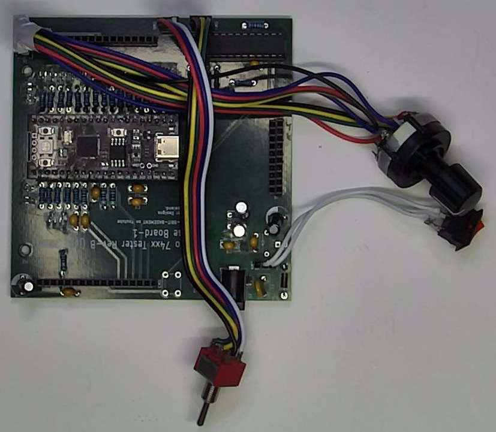

*Figure 11. Front Panel Wiring assembly.*

The OD-PT74 uses three panel-mounted switches that are connected to the Base Board using wiring harnesses.

> **See also:** [Front Panel Wiring Guide](Switch-Wiring-guide.md) for detailed wiring instructions for the panel-mounted switches.

---

## Electrical checks

> [!WARNING]
> Never install the Raspberry Pi Pico or any socketed ICs until the power supply has been verified and the board has been inspected for shorts.

Before applying power:

* Check resistance between 5 V and GND.
* Check resistance between 3.3 V and GND.
* Inspect for solder bridges.
* Confirm regulator orientation.
* Confirm BAT54S orientation.
* Ensure no loose solder or debris remains.

> [!TIP]
> Spending a few minutes checking the board before power-up can prevent hours of fault finding later.

---

## USB Connection Options

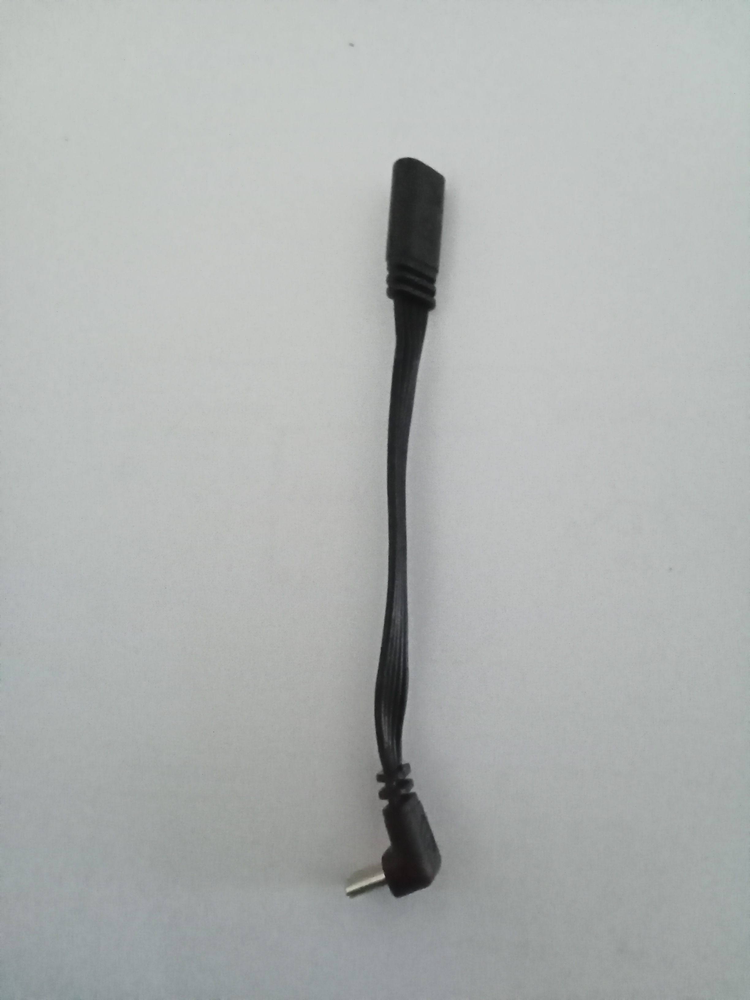

*Figure 11. USB Extension Cable.*

> [TIP]
> IIf you do not wish to fit the internal USB extension cable, a standard 1 metre USB-C cable can be routed through the rear cable slot instead.

Connect the short USB extension cable to the RP2040 and route it alongside the DC power jack.

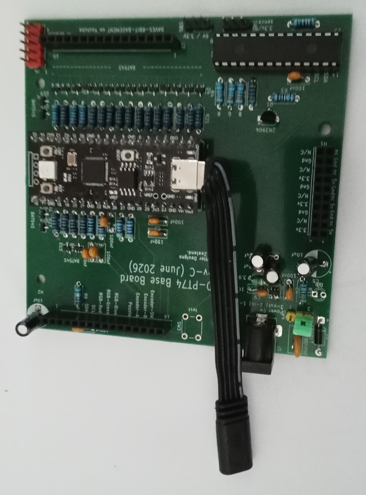

*Figure 12. Usb from RP2040.*

Route the connector through the rear slot in the enclosure next to the 5 V DC power jack.

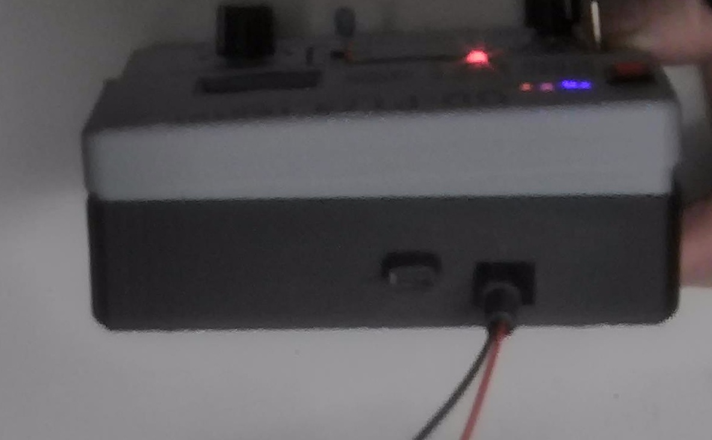

*Figure 13. Back of Case with USB and DC.*

---

## First power-up

Connect the tester to a USB power source.

The tester will automatically perform the **Power-On Self Test (POST)**.

Expected sequence:

1. OLED initialises.
2. POST begins.
3. Hardware checks complete.
4. Main menu appears.
5. Main menu displayed.
6. Ready for testing.

A successful Power-On Self Test (POST) is shown in Figure 11.

*Figure 11. successful (POST) screen.*

If POST reports an error, refer to the **Troubleshooting Guide** before continuing.

---

## Initial functional check

Verify the following operate correctly:

* OLED display
* Rotary encoder
* TEST button
* Package selector
* DUT voltage selector

Figure 12 shows the Main Menu after a successful startup.

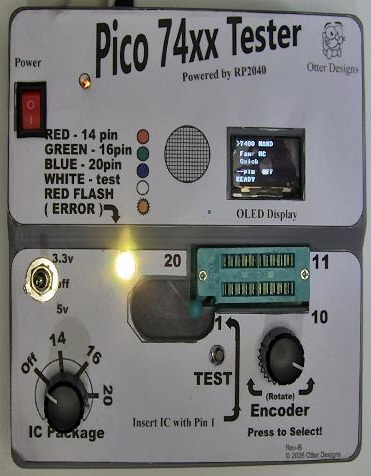

*Figure 12. main menu after startup.*

A successful functional test is shown in Figure 13.

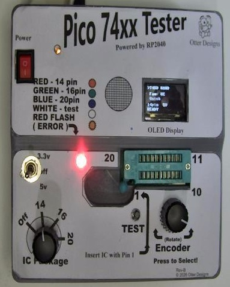

*Figure 13. successful pass result.*

The tester is now ready for its first functional IC test. Continue with the Usage Guide to begin testing supported 74xx-series logic devices.

---

## Next Steps

Your hardware is assembled. Continue with the Firmware Guide to install the latest firmware.

Continue with the following guides to install the firmware, learn how to operate the tester, and explore its supported features.

## Related Documentation

| Document | Description |
|----------|-------------|
| [🏠 Project Home](../../README.md) | Return to the main project page |
| [📖 Documentation Index](../README.md) | Browse all project documentation |
| [🚀 Getting Started](getting-started.md) | First-time setup |
| **🔧 Build Guide** | **You are here** |
| [💾 Firmware Guide](firmware-guide.md) | Installing and updating the firmware |
| [▶️ Usage Guide](usage-guide.md) | Operating the tester |
| [🧩 Supported ICs](supported-ics.md) | List of supported logic devices |
| [🛠 Troubleshooting Guide](troubleshooting-guide.md) | Diagnose common hardware and firmware issues |

---

| ← Previous | Next → |
|------------|--------|
| [🚀 Getting Started](getting-started.md) | [💾 Firmware Guide](firmware-guide.md) |