# Usage Guide

This guide explains how to use the OD-PT74 74xx Logic IC Tester to identify and test supported logic ICs.

---

## Before You Begin

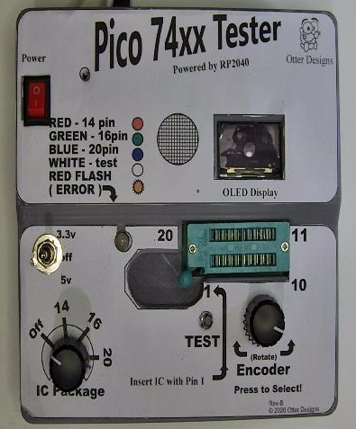

Figure 1 – tester turned off.

Before testing an IC ensure that:

- The firmware has been installed.
- The tester powers on correctly.
- The OLED display is operating.
- The ZIF socket is empty.
- The POST completes without errors.

Always set the IC Voltage Selector to OFF before inserting or removing an IC.
---

## Powering On

Connect the 5 V power supply.

After a few seconds the startup screen is displayed.

---

Figure 2 - powered on, IC voltage off.

---

## Controls

The tester is operated using three controls.

### Voltage Selector

Selects the operating voltage.

---

Figure 3 - 3.3v voltage selected.

---

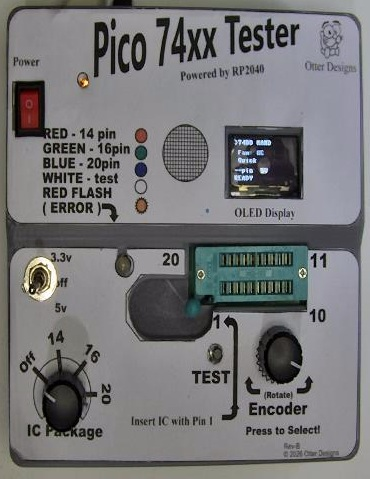

Figure 4 - 5v voltage selected.

---

Always use the correct voltage for the device being tested.
Select 3.3 V for 74LVC, 74HC and other 3.3 V devices (as appropriate for your supported families).
Select 5 V for standard 5 V logic devices.
Never change the voltage while a test is running.

---

## Selecting an IC Package

---

Figure 5 - selected 14 Pin IC

---

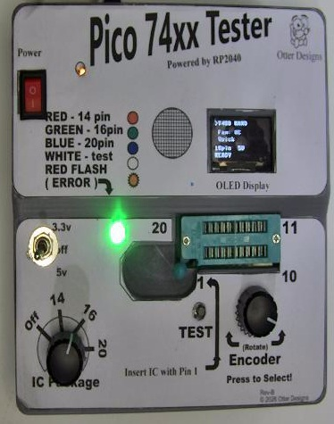

Figure 6 - selected 16 Pin IC

---

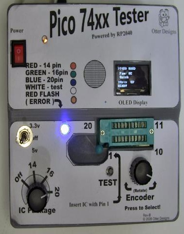

Figure 7 - selected 20 Pin IC

---

Before inserting an IC, ensure the IC Voltage Selector is set to OFF.

Select the package size that matches the IC being tested:

• 14-pin
• 16-pin
• 20-pin

---

## Installing an IC

Raise the ZIF socket lever.

Insert the IC with Pin 1 aligned with the Pin 1 marking.

Close the lever firmly.

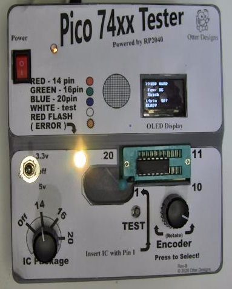

Figure 8 - installing an IC.

After the IC has been installed and the ZIF socket is closed, select the correct supply voltage.

Typical examples are:

• 74HC and 74LVC devices — 3.3 V
• Standard 74xx, 74L and 74LS devices — 5 V

Always verify the correct operating voltage for the IC before testing.

---

## Selecting an IC

Rotate the encoder to select the required IC family and device, then press the encoder to confirm.

Figure 9 - selecting an IC.

---

## Running a Test

Press the TEST button and wait for the result.

The display shows the test progress. 

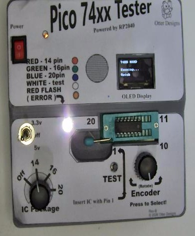

Figure 10 - IC under test.

---

## Quick Test

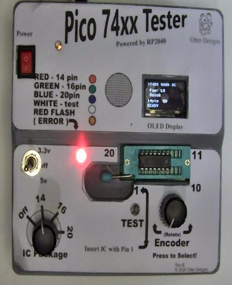

Figure 11 - IC quick test.

---

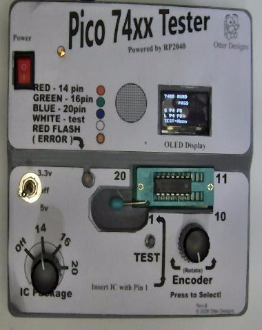

Figure 12 - IC quick test pass.

---

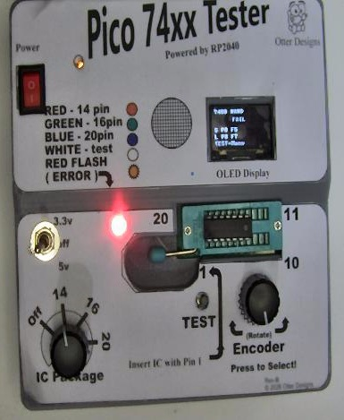

Figure 13 - IC quick test fail.

---

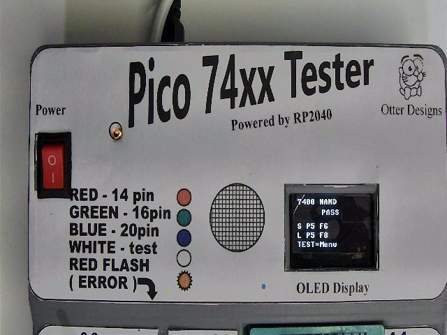

Figure 14 - close-up quick test pass.

---

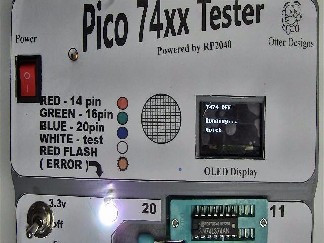

Figure 15 - running quick test.

---

Quick Test performs a rapid functional check of the IC.

Typical execution time is approximately 10 seconds, depending on the device.

### PASS

The IC passed the basic functional tests.

### FAIL

The IC failed one or more functional tests...
---

## Full Test

Full Test performs additional functional verification and therefore takes longer than Quick Test.

Figure 16 - full test pass.

---

Figure 17 - Running full test.

---

Full Test performs a more comprehensive verification than Quick Test.

For maximum confidence, run a Soak Test to exercise the IC continuously over an extended period.

---

## Soak Test

Some devices may be tested continuously.

Select **Soak Test** from the menu.

The tester repeatedly exercises the IC until cancelled.

---

Figure 18 - soak test start.

---

Figure 19 - soak test halfway.

---

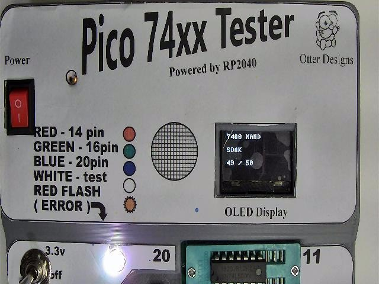

Figure 20 - soak test finished.

---

Soak Test repeatedly exercises the IC to help identify intermittent or temperature-related faults.

As the IC reaches its normal operating temperature, faults that do not appear during shorter tests may become apparent.

---

## Failed IC Example

Figure 21 - failed IC test.

If a test reports FAIL, the IC did not pass one or more functional checks.

For additional diagnostic information, connect the Raspberry Pi Pico USB port to your computer and view the serial output in Thonny or another serial terminal.

If the fault is unclear, check the following before retesting:

• IC Voltage Selector is set correctly.
• IC orientation is correct.
• The correct IC type has been selected.
• The IC pins are clean and undamaged.

---

## Removing an IC

When testing has completed:
1. Switch the IC power to OFF.
2. Open the ZIF socket.
3. Remove the IC.
4. Insert the next IC and close the ZIF socket when ready.

---

## Supported Devices

Refer to the **Supported ICs** document for the complete list of supported devices.

---

## Troubleshooting

If a device repeatedly fails:

- Verify the correct voltage is selected.
- Check IC orientation.
- Confirm the correct device has been selected.
- Inspect the IC for bent or damaged pins.
- Clean oxidised pins if necessary.

For further assistance refer to the **Troubleshooting Guide**.

---

## Next Steps

You should now be familiar with the basic operation of your **OD-PT74 Pico 74xx IC Tester**.

Continue with the following guides to explore the supported IC library or to diagnose hardware and firmware issues if required.

## Related Documentation

| Document | Description |
|----------|-------------|
| [🏠 Project Home](../../README.md) | Return to the main project page |
| [📖 Documentation Index](../README.md) | Browse all project documentation |
| [🚀 Getting Started](getting-started.md) | First-time setup |
| [🔧 Build Guide](build-guide.md) | Hardware assembly |
| [💾 Firmware Guide](firmware-guide.md) | Installing and updating the firmware |
| **▶️ Usage Guide** | **You are here** |
| [🧩 Supported ICs](supported-ics.md) | List of supported logic devices |
| [🛠 Troubleshooting Guide](troubleshooting-guide.md) | Diagnose common hardware and firmware issues |

---

| ← Previous | Next → |
|------------|--------|
| [💾 Firmware Guide](firmware-guide.md) | [🧩 Supported ICs](supported-ics.md) |