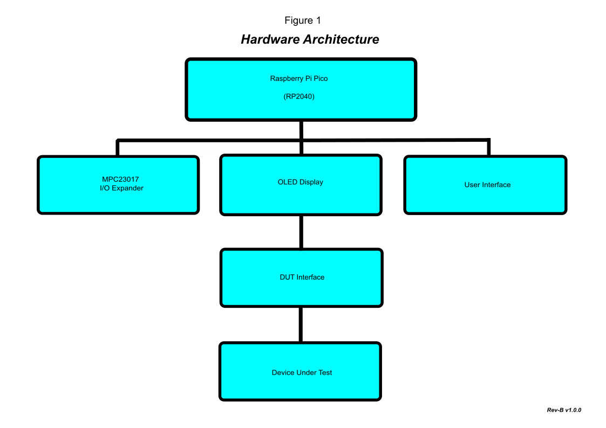

# Hardware Design Guide

## Introduction

This document describes the hardware architecture and design philosophy of the **Rev-B Pico 74xx IC Tester**.

Rather than focusing on assembly or operation, this guide explains the engineering decisions behind the hardware and the major subsystems that make up the tester.

The Rev-B Pico 74xx IC Tester was designed as a dedicated bench instrument for the functional verification of standard 74xx-series logic ICs. The design prioritises reliability, repeatability, ease of construction, and long-term maintainability.

---

## Design objectives

The primary design objectives for Rev-B were:

* Reliable bench operation
* Simple construction using readily available components
* Modular hardware architecture
* Easy firmware development
* Low component count where practical
* Straightforward fault finding
* Expandable firmware support
* Robust operation during normal bench use

Every major hardware decision was made with these objectives in mind.

---

## System architecture

The tester is built around the Raspberry Pi Pico (RP2040) microcontroller and a dedicated hardware platform designed specifically for functional testing of standard logic ICs.

Major hardware subsystems include:

* Raspberry Pi Pico (RP2040)
* MCP23017 I²C GPIO expander
* 20-pin ZIF socket
* OLED display
* Rotary encoder
* TEST and NEXT push buttons
* RGB status LED
* Audible buzzer
* DUT voltage selection
* Package selection

*Figure 1. System architecture of the Rev-B Pico 74xx IC Tester.*

---

## Raspberry Pi Pico

The Raspberry Pi Pico was selected because it provides an excellent balance of performance, flexibility, and cost.

Advantages include:

* RP2040 dual-core microcontroller
* Large number of GPIO pins
* Native USB support
* Excellent MicroPython support
* Widely available
* Well documented
* Strong community support

The Pico performs all user interface, device control, and test sequencing functions.

---

## MCP23017 I/O Expander

The MCP23017 significantly increases the number of available GPIO pins using the I²C bus.

This provides several advantages:

* Simplifies PCB routing
* Reduces wiring complexity
* Frees RP2040 GPIO pins
* Provides additional digital I/O for IC testing

Using the MCP23017 also allows the firmware to remain modular and simplifies future expansion.

---

## Power system

The Rev-B tester is powered from a standard 5 V USB supply.

An onboard voltage regulator generates the 3.3 V rail required by the RP2040, MCP23017, and OLED display.

The DUT supply voltage is selectable:

* OFF
* 3.3 V
* 5 V

This allows the tester to support both modern CMOS devices and traditional TTL logic families.

The power supply section is assembled and verified before the remainder of the board to simplify fault finding during construction.

---

## Device Under Test (DUT) interface

The DUT interface has been designed for simplicity and reliability.

Features include:

* 20-pin ZIF socket
* Package selection
* DUT voltage selection
* GPIO protection resistors
* Clamp diode protection
* Clearly marked pin orientation

The tester supports:

* 14-pin DIP
* 16-pin DIP
* 20-pin DIP

using conventional 74xx-series power pin arrangements.

---

## User interface

The tester is operated using:

* Rotary encoder
* TEST button
* NEXT button
* 128 × 64 OLED display
* RGB status LED
* Audible buzzer

This combination provides a straightforward user experience while keeping the front panel uncluttered.

---

## Hardware protection

Several protection features have been incorporated into the design.

These include:

* GPIO series resistors
* Clamp diode protection
* Controlled DUT voltage switching
* Regulated power supply

These measures improve the robustness of the tester during normal operation but do not eliminate the need for good handling practices.

> [!WARNING]
> The tester is designed for supported 74xx-series logic ICs only. It is not intended to be connected directly to external circuits while testing.

---

## Design philosophy

The Rev-B Pico 74xx IC Tester is a dedicated bench instrument rather than a general-purpose development platform.

The design intentionally favours:

* Simplicity
* Reliability
* Repeatability
* Ease of construction
* Ease of maintenance

Rather than supporting every possible logic device, Rev-B concentrates on the most commonly encountered 74xx-series logic ICs used in electronics repair, education, and hobby projects.

This focused approach results in a tester that is straightforward to build, easy to use, and highly reliable in everyday bench use.

---

## Design limitations

The following limitations are intentional design decisions:

* Supports standard 14-, 16-, and 20-pin DIP packages.
* Supports conventional 74xx-series power pin arrangements.
* Performs functional verification only.
* Does not perform analogue measurements.
* Does not measure propagation delay.
* Does not characterise device performance.
* Does not support adapter-based devices.

These limitations help keep the hardware simple while providing comprehensive functional testing for the majority of commonly encountered logic ICs.

---

## Firmware interaction

The hardware has been designed to work closely with the modular firmware architecture.

Hardware-specific drivers are separated from the test engine and IC definitions, allowing new devices to be added with minimal impact on the core firmware.

This modular approach simplifies maintenance and future firmware enhancements.

---

## Summary

The Rev-B Pico 74xx IC Tester combines a purpose-designed hardware platform with modular MicroPython firmware to provide a reliable and easy-to-use instrument for testing standard 74xx-series logic ICs.

Every major design decision reflects the project's primary objective: delivering a practical, dependable bench instrument that is straightforward to build, maintain, and use.
