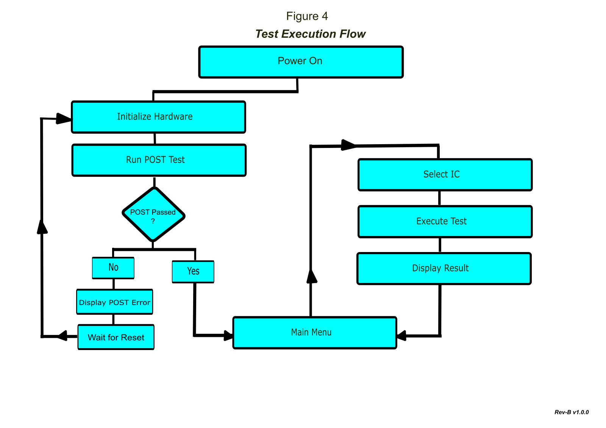

# Usage Guide

## Introduction

This guide explains the normal operation of the **Rev-B Pico 74xx IC Tester**.

It covers powering the tester, selecting a device, running tests, interpreting the results, and using the available test modes.

If you have not yet assembled your tester, complete the **Build Guide** before continuing.

---

## Before you begin

Before testing an IC, ensure that:

* The hardware has been assembled successfully.
* The Power-On Self Test (POST) completes without errors.
* The latest Rev-B firmware is installed.

> [!TIP]
> For your first test, use a known-good **74LS00** or **74HC00**. These devices are common, easy to verify, and ideal for confirming correct operation.

---

## Powering the tester

Connect the tester to a suitable USB power source.

On power-up the tester automatically performs the **Power-On Self Test (POST)**.

The expected startup sequence is:

1. Splash screen
2. Power-On Self Test (POST)
3. Main Menu

The startup sequence is illustrated in Figure 1.

*Figure 1. Power-On Self Test (POST).*

If POST reports an error, refer to the **Troubleshooting Guide** before continuing.

---

## Your first IC test

This example demonstrates a complete test using a **74LS00 Quad 2-Input NAND Gate**.

### Step 1 – Select the package

Select:

* **14-pin DIP**
* **5 V DUT supply**

Figure 2 shows the package selection screen.

*Figure 2. Package selection.*

---

### Step 2 – Select the IC

Rotate the encoder until **74LS00** is displayed.

Press the encoder to confirm your selection.

Figure 3 shows the device selection screen.

*Figure 3. Device selection.*

---

### Step 3 – Insert the IC

Open the ZIF socket.

Insert the IC with **Pin 1** correctly aligned.

Close the ZIF socket.

> [!IMPORTANT]
> Never insert or remove an IC while a test is running.

Figure 4 illustrates the correct orientation of the IC in the ZIF socket.

*Figure 4. IC correctly installed.*

---

### Step 4 – Start the test

Press the **TEST** button.

The tester will execute the selected test sequence.

Figure 5 shows a test currently in progress.

*Figure 5. Test in progress.*

---

### Step 5 – Review the result

If the IC passes every test, the display reports:

**PASS**

A successful test result is shown in Figure 6.

*Figure 6. Successful PASS result.*

Congratulations—your tester is now fully operational.

---

## Main menu

The Main Menu provides access to the tester's operating functions.

Depending on the installed firmware version, the Main Menu may provide access to:

* Device Selection
* Test Mode
* Package Selection
* DUT Voltage
* System Information
* About

Figure 7 shows the Main Menu.

*Figure 7. Main Menu.*

---

## Test modes

The tester provides three operating modes.

### Quick Test

A rapid functional verification suitable for routine testing.

Recommended for checking known devices.

---

### Full Test

Performs a comprehensive functional verification using all available test vectors.

Recommended for unknown or suspect ICs.

---

### Soak Test

Repeatedly tests the selected IC to identify intermittent faults.

Available options:

* 50 cycles
* 500 cycles
* Continuous

Figure 8 illustrates the test mode selection menu.

*Figure 8. Test mode selection.*

---

## Understanding the results

### PASS

The IC completed every test successfully.

No functional faults were detected.

---

### FAIL

The tester detected one or more unexpected outputs.

Common causes include:

* Faulty IC
* Incorrect device selected
* Incorrect package selected
* Incorrect DUT voltage
* Poor contact in the ZIF socket
* Bent or contaminated IC pins

An example FAIL result is shown in Figure 9.

*Figure 9. FAIL result.*

If a device repeatedly fails, refer to the **Troubleshooting Guide**.

---

## Understanding how the tester works

The Pico 74xx IC Tester performs functional verification by applying predefined logic patterns to the selected device and comparing the observed outputs with the expected truth table.

The overall operating sequence is illustrated in Figure 10.

*Figure 10. Test execution flow of the Rev-B Pico 74xx IC Tester.*

Each supported device has its own dedicated test definition, allowing the firmware to verify the logical behaviour of individual gates, counters, registers, decoders, multiplexers, and other digital logic devices.

The tester is intended to verify functional operation. It does not perform analogue measurements, propagation delay analysis, or detailed electrical characterisation.

---

## Best practices

For reliable test results:

* Verify the correct package size before inserting an IC.
* Select the correct DUT supply voltage.
* Check the orientation of Pin 1.
* Keep IC pins clean and straight.
* Test known-good devices before testing suspect ICs.
* Repeat a test if an intermittent fault is suspected.
* Use Soak Test mode for long-term stability testing.

---

## Troubleshooting

If the tester does not behave as expected:

* Repeat the test.
* Confirm the correct IC has been selected.
* Verify the package size.
* Verify the DUT supply voltage.
* Check the IC orientation.
* Inspect the IC pins for damage or contamination.

If problems persist, consult the **Troubleshooting Guide**.

---

## Next steps

Now that you are familiar with the tester, you may wish to explore the following documentation:

* [Supported ICs](supported-ics.md)
* [Project Overview](project-overview.md)
* [Troubleshooting Guide](troubleshooting.md)

Thank you for building and using the Rev-B Pico 74xx IC Tester. Feedback, bug reports, and contributions are always welcome as the project continues to evolve.